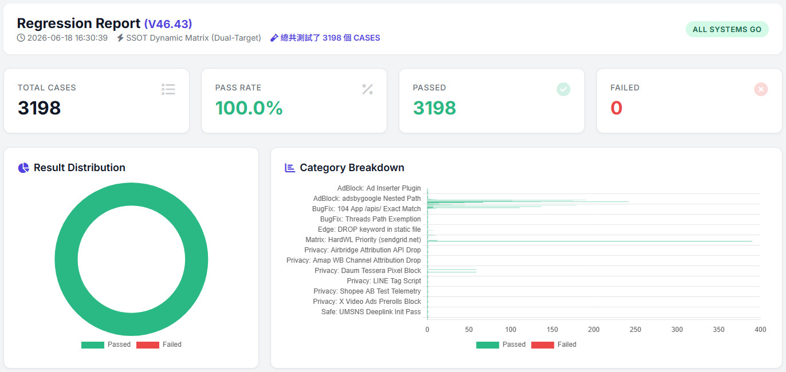

# URL Ultimate Filter

Advanced URL filtering, tracking parameter removal, and privacy protection rules for content blockers, DNS filtering solutions, and network filtering platforms.

[](LICENSE)
[](https://github.com/fkhb90/URL_Ultimate_Filter/commits/main)
[](https://github.com/fkhb90/URL_Ultimate_Filter/issues)
[](https://github.com/fkhb90/URL_Ultimate_Filter/stargazers)



## Overview

URL Ultimate Filter is an open-source filtering project focused on:

- Tracking parameter removal
- URL sanitization
- Privacy protection
- Analytics reduction
- Cleaner sharing links
- Improved browsing experience

The project helps reduce unnecessary tracking information embedded in URLs and improves privacy across websites, advertising networks, and analytics platforms.

## Open Source Mission

The goal of this project is to provide a continuously maintained collection of URL filtering and tracking-parameter removal rules that help users:

- Protect privacy
- Reduce tracking exposure
- Improve browsing efficiency
- Create cleaner and shareable URLs

The project is developed and maintained as an independent open-source effort and is freely available to the community.

---

## Why This Project Exists

Many websites append tracking parameters to URLs, including:

```text
utm_source=
utm_medium=
utm_campaign=
fbclid=
gclid=
msclkid=
mc_eid=
_ga=
```

These parameters are commonly used for:

- Marketing attribution
- User profiling
- Advertising analytics
- Cross-site tracking

Removing unnecessary parameters provides:

- Cleaner URLs
- Improved privacy
- Better sharing experience
- Reduced tracking exposure

---

## Features

### Tracking Parameter Removal

Automatically removes common tracking parameters such as:

```text
utm_*
fbclid
gclid
msclkid
mc_eid
_ga
_gl
```

### URL Sanitization

Converts URLs into cleaner and more readable forms.

**Before**

```text
https://example.com/article?id=123&utm_source=facebook&utm_medium=social&fbclid=abc123
```

**After**

```text
https://example.com/article?id=123
```

### Privacy Protection

Reduces exposure to:

- Advertising identifiers
- Campaign identifiers
- Tracking tokens
- Analytics metadata

### Rule-Based Architecture

Easy to maintain and extend.

Rules can be updated independently without modifying application logic.

---

## Supported Platforms

The rule set is designed to work with ecosystems including:

- Surge
- AdGuard
- uBlock Origin
- DNS Filtering Solutions
- Custom Proxy Rules
- Network Filtering Platforms

Compatibility may vary depending on platform capabilities.

---

## Tooling

These rules are developed and maintained with the help of a companion command-line tool:

- **[url-filter-analyzer](https://github.com/fkhb90/url-filter-analyzer)** — lint, test, diff, and analyze ad-block / URL filter lists. It catches duplicate or unmatchable rules and shows exactly which rule blocks (or allows) a given URL, so changes to this project can be verified before publishing.

---

## Installation

### Tampermonkey (recommended for browsers)

1. Install the [Tampermonkey](https://www.tampermonkey.net/) extension.
2. Click the direct install link below — Tampermonkey will prompt you to confirm.

**[Install URL Ultimate Filter (Tampermonkey)](https://raw.githubusercontent.com/fkhb90/URL_Ultimate_Filter/main/URL-Ultimate-Filter-Tampermonkey.user.js)**

### uBlock Origin / AdGuard

Add the raw filter-list URL as a custom filter source:

```
https://raw.githubusercontent.com/fkhb90/URL_Ultimate_Filter/main/URL-Ultimate-Filter-Surge.js
```

In uBlock Origin: Dashboard → Filter lists → Import → paste the URL above.
In AdGuard: Settings → Filters → Custom → Add custom filter → paste the URL above.

### Surge (iOS / macOS)

Add to your Surge configuration:

```
[URL Rewrite]
# URL Ultimate Filter — import the rule set
https://raw.githubusercontent.com/fkhb90/URL_Ultimate_Filter/main/URL-Ultimate-Filter-Surge.js
```

### Manual / self-hosted

```bash
git clone https://github.com/fkhb90/URL_Ultimate_Filter.git
```

To regenerate the output files from the source rules:

```bash
python SSOT_Compiler.py
```

---

## Repository Structure

```text
URL_Ultimate_Filter/
├── rules/
├── examples/
├── docs/
├── README.md
└── LICENSE
```

---

## Use Cases

### Privacy-Conscious Users

Remove unnecessary tracking identifiers before sharing links.

### Network Administrators

Deploy filtering rules across managed devices.

### Security Researchers

Analyze URL tracking behavior and marketing attribution mechanisms.

### Content Blocker Users

Enhance existing privacy protection solutions.

---

## Roadmap

Planned improvements include:

- Additional tracking parameter coverage
- More analytics platform support
- Enhanced documentation
- Platform-specific integration guides
- Community contribution support

---

## Contributing

Contributions are welcome.

You can help by:

- Reporting issues
- Suggesting new rules
- Submitting pull requests
- Improving documentation

Please open an issue before making major changes.

---

## Project Status

Actively maintained.

This repository receives ongoing updates as new tracking parameters and URL patterns emerge across the web ecosystem.

---

## License

This project is licensed under the MIT License.

See the [LICENSE](LICENSE) file for details.

---

## Maintainer

GitHub: https://github.com/fkhb90


## Acknowledgments

Inspired by the privacy and filtering communities, including:

- https://github.com/gorhill/uBlock
- https://github.com/AdguardTeam/AdGuardFilters
- https://github.com/easylist/easylist

---

## Keywords

privacy, tracking protection, url filtering, url sanitizer, adblock, adguard, ublock-origin, surge, dns filtering, analytics blocking, content filtering
